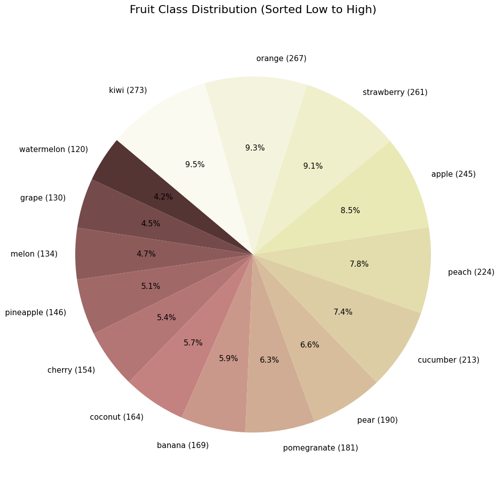
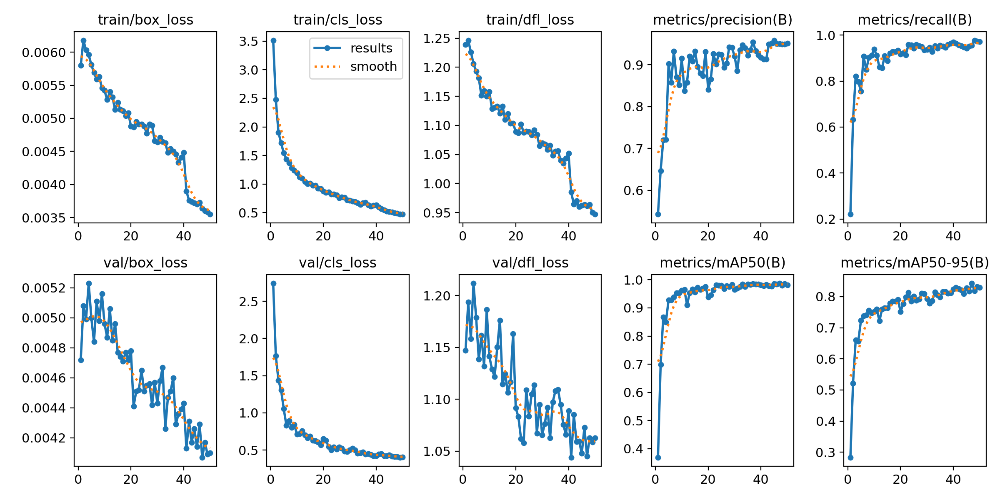
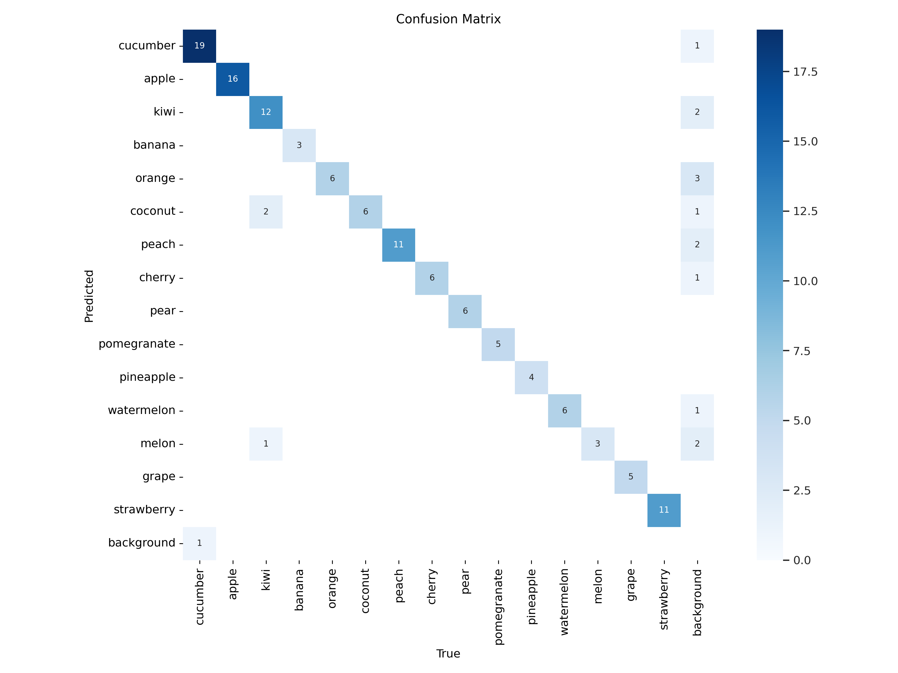
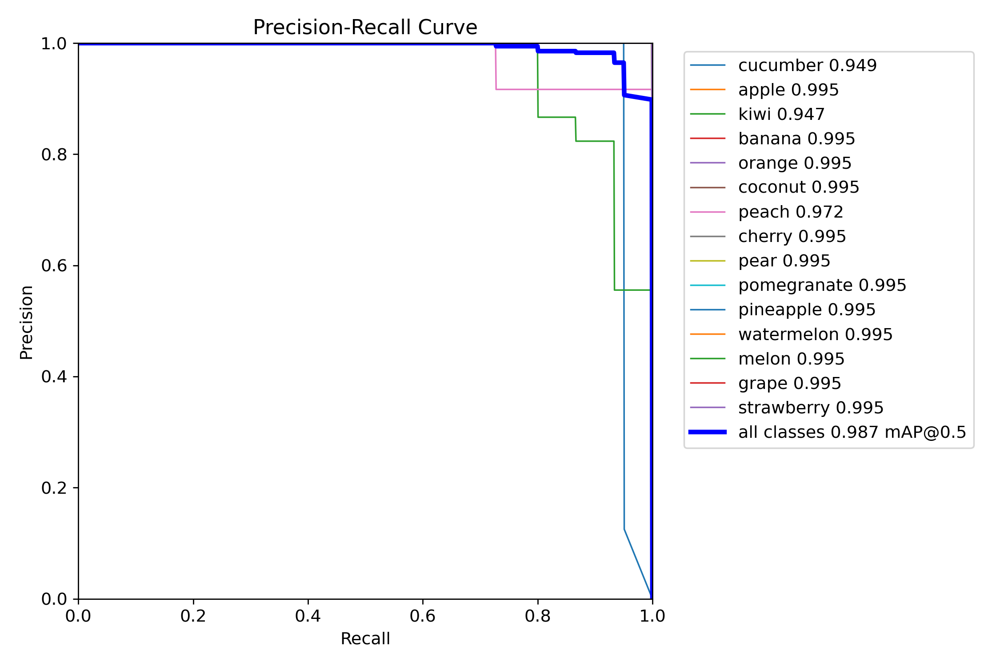
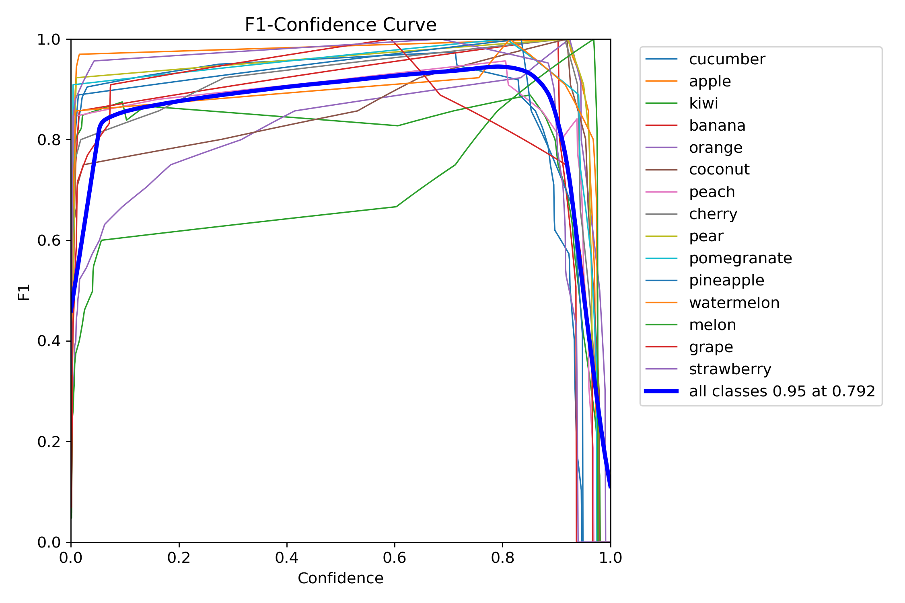

# 🧠 Smartbite: AI-powered Fruit Detector & Nutrition Estimator

Smartbite is an AI-based application built using YOLO (You Only Look Once) that identifies fruits from an uploaded image and provides an accurate nutritional breakdown per fruit based on a selected serving size. It also offers the option to download the analysis as a professional PDF report.

---

## 🚀 Features

- 🍎 **Automatic Fruit Detection** using a YOLOv8 model.
- 📊 **Nutritional Analysis** based on the detected fruit and user-selected serving size.
- 🧾 **PDF Report Generation** with detected images and a nutrient table.
- 🖼️ Streamlit-based GUI for easy interaction and usability.
- 📥 Downloadable, professional-style reports for diet tracking or educational use.

---

## 🔍 Why This Project Is Useful

### 🎯 Health & Wellness Tracking
Helps users better understand the nutritional value of fruits they consume regularly, promoting healthier dietary habits.

### 👨‍🏫 Educational Tool
Can be used in classrooms and training environments to teach about computer vision, healthy eating, or both.

### 🍽️ Diet Planning
Assists fitness coaches and nutritionists in creating accurate, fruit-based meal plans.

### 📷 Computer Vision Application
Demonstrates the use of real-time object detection and classification in a practical, user-centric application.

---

## 🛠️ Tech Stack

- **Frontend:** Streamlit
- **Model:** YOLOv8
- **Backend:** Python, PIL, FPDF
- **Visualization:** Matplotlib, Pandas

---

## 📦 Dataset

The Smartbite model was trained on a custom-curated dataset consisting of labeled images for **15 different fruit classes**. Each image includes bounding boxes that annotate individual fruits, allowing the YOLOv8 model to learn precise object detection and classification.

### 📊 Class Distribution

The dataset maintains a fairly balanced distribution across all classes, minimizing model bias and ensuring robust training.



- Most represented: **Kiwi (273)**, **Orange (267)**, **Strawberry (261)**
- Least represented: **Watermelon (120)**
- Distribution range: ~4% to ~9.5% per class

### 🍇 Included Classes

- Apple
- Banana
- Cherry
- Coconut
- Cucumber
- Grape
- Kiwi
- Melon
- Orange
- Peach
- Pear
- Pineapple
- Pomegranate
- Strawberry
- Watermelon

### 🗂️ Folder Structure

dataset/
├── images/
│ ├── train/
│ ├── val/
├── labels/
│ ├── train/
│ ├── val/

Each image is annotated in YOLO format.

---

## 🧪 Model Training Results

The YOLOv8 model was trained to detect multiple fruit categories. Below are the performance metrics over 50 epochs:

### 📉 Training & Validation Loss
| Metric        | Trend (↓)        |
|---------------|------------------|
| `train/box_loss` | Decreasing steadily |
| `val/box_loss`   | Decreasing with some noise |
| `train/cls_loss` | Sharp decline in early epochs |
| `val/cls_loss`   | Follows training trend |
| `train/dfl_loss` | Gradual decline |
| `val/dfl_loss`   | Slightly noisier decline |

### 📈 Precision, Recall, and mAP
| Metric            | Value (Final Epoch) |
|-------------------|---------------------|
| `precision(B)`     | ~0.96               |
| `recall(B)`        | ~0.97               |
| `mAP@0.5`          | ~0.95               |
| `mAP@0.5:0.95`     | ~0.85               |



These metrics indicate the model is both highly accurate and robust in detecting fruit categories.

---

## 🧩 Confusion Matrix

The confusion matrix below shows the model’s prediction accuracy across the 15 fruit classes.



#### 🔍 Interpretation:

- **Diagonal dominance** (darker blue) indicates the model correctly identifies most fruits — e.g., `cucumber`, `apple`, `kiwi`, and `strawberry` all have strong diagonal counts.
- **Off-diagonal values** represent misclassifications, such as:
  - `banana` misclassified as `apple` (3 times)
  - `coconut` confused with `apple` or `peach`
  - A few fruits like `melon` or `grape` also had occasional errors
- The matrix includes a **`background` class**, ensuring the model isn't falsely detecting fruits where none exist — essential for robust detection.

---

## 📈 Evaluation Curves

- **Precision-Recall Curve**  
  

- **F1 Score Curve**  
  


## 🖥️ GUI Snapshot

The interface allows easy image upload, serving size selection, and download of results:


---

## 🤔 Results with Identified Fruit image and Nutrient summary


## 📄 PDF Report Example

A sample output report includes:
- The uploaded image.
- The detection result with bounding boxes.
- A nutrient breakdown per fruit based on serving size.


---

## ▶️ How to Run

1. Install dependencies:
    ```bash
    pip install -r requirements.txt
    ```

2. Launch the app:
    ```bash
    streamlit run app.py
    ```

3. Upload a fruit image and receive nutritional insights instantly!

---

## 🧠 Future Enhancements

- 🔄 Real-time webcam-based detection
- 📦 Upload support for multiple images
- 🥗 Integration with broader meal tracking systems

---
